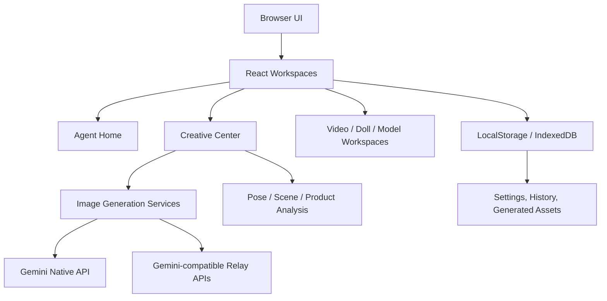

<div align="center">
  <br />
  
  <h1>小彻工作台</h1>
  <p><strong>XcAI Studio · AI 电商视觉生产中枢</strong></p>
  <p>
    面向跨境电商、服装品牌、内容团队和视觉运营的一站式 AI 工作台。<br />
    从商品图、模特图、动作姿势、场景氛围到短视频策划，集中完成高质量商业视觉生产。
  </p>

  <p>
    
    
    
    
    
    
  </p>

  <p>
    <a href="#核心能力">核心能力</a>
    ·
    <a href="#创意中心">创意中心</a>
    ·
    <a href="#模特姿势裂变">模特姿势裂变</a>
    ·
    <a href="#技术架构">技术架构</a>
    ·
    <a href="#快速开始">快速开始</a>
    ·
    <a href="#部署">部署</a>
  </p>
  <br />
</div>

---

## 产品定位

XcAI Studio 不是单点生图工具，而是一套为真实电商视觉流水线设计的 AI 工作台。

它把商品素材、模特身份、服装结构、动作姿势、场景光影、平台风格和生成结果管理放在同一个界面里，帮助团队更快完成从“素材输入”到“可用于投放或上架的视觉方案”的探索。

核心原则：

- **商业可用**：优先服务主图、副图、A+、独立站、社媒短视频等实际业务场景。
- **参考图分工明确**：商品图管产品，模特图管身份，场景图管环境，动作图管姿势。
- **一致性优先**：模特长相、肤色、体型、服装版型、面料纹理和原场景调性不随意漂移。
- **AI 生成 + 人工控制**：生成后支持预览、重生成、下载、裁图等二次控制。

## 核心能力

| 能力 | 说明 | 适合场景 |
| --- | --- | --- |
| AI Agent 首页 | 多模型对话、图片上传、任务入口、历史项目 | 日常视觉策划与任务分发 |
| 创意中心 | 主图生成、产品替换、局部替换、高清放大、风格复刻、场景图生成 | 电商图片批量生产 |
| 模特姿势裂变 | 保持模特与场景风格，迁移动作参考图姿势 | 服装模特图扩展 |
| 模特原图贴回 | 将生成效果回贴到原图语境中 | 精修与一致性回收 |
| 商业动作库 | 按品类、风格和平台组织动作预设 | 无动作参考图时自动补齐 |
| 视频站 / AI 视频 | 脚本、分镜、素材规划与短视频生成辅助 | TikTok、Amazon、独立站内容 |
| 精修工作台 | 玩偶、毛绒、钥匙扣类商品图处理 | 礼品与玩具电商 |
| 模特工厂 | 模特生成、模特素材管理 | 品牌模特资产建设 |
| API Studio | Gemini 原生与兼容中转服务统一配置 | 多模型、多供应商路由 |

## 创意中心

创意中心是 XcAI Studio 的核心生产台，围绕“上传参考图 -> 构建商业画面 -> 生成结果 -> 精修复用”的流程设计。

### 主图生成

- 支持 `1:1`、`2:3`、`3:4`、`9:16`、`16:9` 等常用电商比例。
- 支持 Amazon、SHEIN、Temu、天猫淘宝、独立站等平台风格。
- 支持商品图、模特图、场景参考图、动作参考图、配饰参考图组合输入。
- 服装商品优先保持版型、领口、袖口、腰线、纹理、图案、面料和颜色。
- 可通过补充说明约束正面、背面、侧面、半身、全身、坐姿、走路、靠墙等生成方向。

### 图像工具

| 工具 | 用途 |
| --- | --- |
| 产品替换 | 将商品自然替换到指定人物或场景中 |
| 局部替换 | 对局部区域进行重绘和修复 |
| 高清放大 | 提升图片清晰度和商业质感 |
| 风格复刻 | 参考已有视觉风格批量生成同调性图片 |
| 场景图生成 | 根据产品和场景参考生成营销环境图 |
| 比例查询 | 辅助判断平台画幅与素材适配 |

## 模特姿势裂变

这是当前重点能力：在不破坏原模特身份和原场景风格的前提下，让 AI 学习动作参考图的姿势、构图和身体关系。

### 生成优先级

1. **模特整体参考图权重最高**  
   脸型、发型、肤色、体型、服装、光线和主场景调性必须优先保持。

2. **动作参考图只控制姿势与构图**  
   动作图用于提取身体角度、四肢关系、镜头范围、站姿、坐姿、倚靠方式，不复制参考图人物身份。

3. **场景允许轻量适配**  
   当动作需要墙面、椅子、沙发、桌沿或扶手等支撑关系时，允许在原场景风格内增加或调整支撑物，但不应大幅更换场景。

4. **拒绝原图直出**  
   结果不能只是返回原模特图，必须体现动作参考图的关键姿势变化。

5. **裁图后置处理**  
   生成结果可按当前画幅比例锁定裁切，方便输出平台所需构图。

### 动作库

动作库按商品品类和风格组织，适合用户未上传动作参考图时自动补齐商业姿势。

| 动作库 | 风格方向 |
| --- | --- |
| 通用服装动作库 | 百搭站姿、走路、半身、全身 |
| 男士衬衫 / Polo / T 恤 | 度假、街拍、咖啡厅、城市通勤 |
| 男士短裤 / 长裤 / 泳裤 | 运动、休闲、沙滩、户外 |
| 长裙 / 连衣裙 | 优雅、坐姿、侧身、裙摆展示 |
| Suri Mira 宫廷法式复古连衣裙 | 法式复古、宫廷感、花园、窗边、沙发、墙面倚靠 |
| 大码女装 / Y2K Editorial | 自信展示、高街、杂志感 |

## 技术架构



## 技术栈

| 层级 | 技术 |
| --- | --- |
| Frontend | React 19, TypeScript, Vite 6 |
| UI | Utility CSS, Framer Motion, Lucide React |
| AI | `@google/genai`, `@google/generative-ai`, Vercel AI SDK |
| Storage | LocalStorage, IndexedDB, `idb` |
| State | React State, Zustand |
| Markdown | React Markdown, Remark GFM |
| Deployment | Vercel, Docker, Nginx, Static Hosting |

## 目录结构

```text
.
├── App.tsx                    # 根应用与工作台路由
├── components/                # 首页、聊天、设置、历史、通用 UI
├── Cyzx4/                     # 创意中心
│   ├── components/            # 主图、场景、姿势、修复、迁移等功能页
│   ├── constants/             # 动作库与预设数据
│   ├── services/              # Gemini prompt、生图、分析服务
│   ├── hooks/                 # 创意中心 hooks
│   ├── types/                 # 领域类型
│   └── utils/                 # API 路由、图片压缩、图像工具
├── AIVideo/                   # AI 视频工作台
├── DollFactory/               # 精修工作台
├── ModelFactory/              # 模特工厂
├── XcAISTUDIO-main/           # 视频站
├── services/                  # 跨模块服务
├── public/                    # 静态资源
├── docs/                      # 文档与辅助资料
├── Dockerfile                 # 生产镜像
├── docker-compose.yml         # Docker 本地部署
├── vercel.json                # Vercel SPA rewrite
└── vite.config.ts             # Vite 配置
```

## 快速开始

### 环境要求

- Node.js 20+
- npm 10+
- Gemini API Key 或兼容中转服务 Key

### 安装依赖

```bash
npm install
```

### 配置环境变量

在根目录创建 `.env.local`：

```env
GEMINI_API_KEY=your_gemini_api_key
VITE_GEMINI_API_KEY=your_gemini_api_key
```

也可以不写环境变量，直接在应用的设置面板中填写 API Key、Base URL 和模型配置。

### 本地开发

```bash
npm run dev
```

默认开发服务端口为：

```text
http://localhost:3000
```

### 生产构建

```bash
npm run build
```

### 本地预览

```bash
npm run preview
```

## 部署

### Vercel

项目包含 `vercel.json`，已配置 SPA fallback。

| Setting | Value |
| --- | --- |
| Build Command | `npm run build` |
| Output Directory | `dist` |
| Install Command | `npm install` |

### Docker

```bash
docker compose up --build
```

启动后访问：

```text
http://localhost:8080
```

### 静态托管

本项目是 Vite SPA。任意静态托管平台都可以部署 `dist/`，但需要将所有路由回退到 `index.html`。

## 配置说明

设置面板会将 API 与 Agent 配置保存在浏览器本地。

| Key | 用途 |
| --- | --- |
| `user_gemini_api_key` | Gemini 原生 API Key |
| `user_gemini_base_url` | Gemini 原生 Base URL |
| `yunwu_api_key` | 云雾中转 Key |
| `yunwu_base_url` | 云雾中转 Base URL |
| `plato_api_key` | 柏拉图中转 Key |
| `plato_base_url` | 柏拉图中转 Base URL |
| `jijing_api_key` | No.1 图中转 Key |
| `jijing_base_url` | No.1 图中转 Base URL |
| `agentName` | 自定义 Agent 名称 |
| `agentRole` | 自定义 Agent 角色 |
| `agentCapabilities` | 自定义 Agent 能力提示词 |

## 质量原则

- 模特图优先保持脸型、发型、肤色、体型比例和人物气质。
- 产品图优先保持结构、面料、纹理、图案、颜色和版型。
- 场景变化必须服务动作与构图，不应无意义更换背景。
- 动作参考图只提取姿势和身体关系，不复制人物和场景。
- 生成结果必须经过人工复核后再用于付费投放或正式上架。

## 常见问题

| 问题 | 排查方向 |
| --- | --- |
| 生图失败 | 检查 API Key、Base URL、模型与中转启用状态 |
| 结果像原图没变化 | 检查动作参考图是否清晰，或补充说明明确“必须改变姿势” |
| 靠墙/坐姿悬空 | 动作参考图需要有明确接触点，也可补充要求同风格支撑物 |
| 商品细节漂移 | 增加商品细节图，并在补充说明中锁定版型和纹理 |
| 构建出现大 chunk 警告 | 多工作台体量较大，警告不等于构建失败 |

## Roadmap

- 生成结果自动 QA：身份一致性、产品一致性、动作匹配度、场景兼容度。
- 更细的商业动作库：按平台、品类、季节、风格和镜头范围组合。
- 品牌视觉资产包：固定光线、色调、模特、场景和构图规则。
- 团队级素材库：云端历史、多人协作、版本管理。
- 自动化冒烟测试：覆盖创意中心关键生图链路。

## License

This repository is proprietary unless a license file is added.

---

<div align="center">
  <strong>XcAI Studio</strong>
  <br />
  Fast, controlled and commercially usable AI visual production.
</div>
