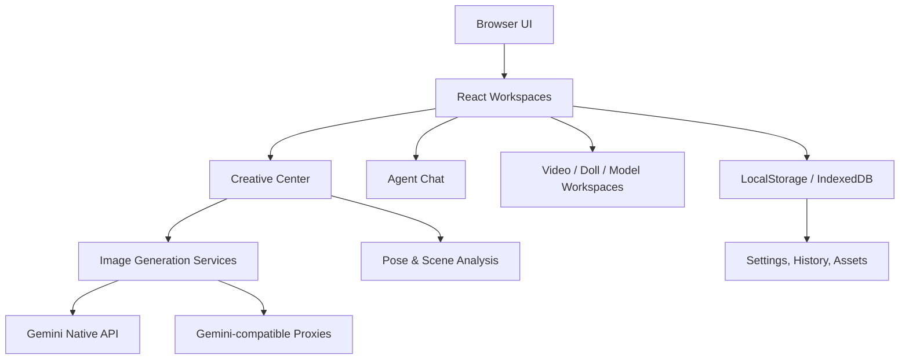

# XcAI Studio

> 面向跨境电商与内容团队的一站式 AI 视觉生产工作台，覆盖商品图、模特图、场景图、视频策划、素材管理与多模型 API 调度。

XcAI Studio 将电商视觉生产中最耗时的环节产品化：从商品素材上传、模特身份锁定、场景与动作参考、批量主图生成，到局部替换、高清放大、风格复刻、短视频脚本与历史资产沉淀，都可以在同一个 Web 工作台中完成。

项目当前以 React + TypeScript + Vite 构建，核心目标是让运营、设计、摄影后期和品牌团队用更少的沟通成本完成高质量视觉探索，并在商业投放前保留足够的人工审核空间。

## Highlights

- **多工作台入口**：统一承载 Agent 首页、创意中心、视频站、AI 视频、玩偶工厂、模特工厂与云雾 API Studio。
- **电商主图生产**：支持平台风格、画幅比例、产品参考、模特参考、场景参考、动作参考和配饰参考。
- **模特姿势裂变**：在保持模特长相、服装结构和原场景风格的前提下，参考动作图生成新的姿势与构图。
- **动作参考智能分析**：自动分析动作图的身体范围、支撑物、坐姿/靠墙/倚靠关系和场景兼容性，减少手动按钮和参数。
- **商业动作库**：内置按品类组织的姿势预设，包含 Suri Mira 宫廷法式复古连衣裙等细分风格动作库。
- **生成结果裁切**：支持按当前画幅比例锁定裁剪，用户可对生成图做二次构图微调。
- **多 API 通道**：支持 Gemini 原生 API 及多个 Gemini 兼容中转服务，在前端设置面板中统一管理。
- **本地资产沉淀**：通过浏览器本地存储保存配置、历史项目和生成资产，方便回看与复用。

## Product Modules

| 模块 | 能力 | 适用场景 |
| --- | --- | --- |
| Agent 首页 | 多模型对话、图片上传、工作台入口、历史项目 | 日常 AI 助手与任务分发 |
| 创意中心 | 主图生成、产品替换、局部替换、高清放大、风格复刻、场景图生成 | 电商视觉生产 |
| 模特姿势裂变 | 模特身份锁定、动作参考迁移、场景兼容调整、比例裁切 | 服装模特图批量扩展 |
| 模特原图贴回 | 将生成效果回贴到原图语境中 | 保持素材一致性的精修流程 |
| 视频站 / AI 视频 | 视频脚本、分镜策划、素材规划 | TikTok、Amazon、独立站视频内容 |
| 玩偶工厂 | 玩偶类商品图调整与主图生产 | 玩具、毛绒、钥匙扣类商品 |
| 模特工厂 | 模特生成与模特素材管理 | 品牌模特资产建设 |
| 云雾 API Studio | API Key、Base URL、模型与中转配置 | 多服务商模型路由管理 |

## Creative Center

创意中心是当前最核心的电商视觉工作台，围绕“上传参考图 -> 生成商业视觉 -> 精修与复用”的流程设计。

### 主图生成

- 支持 `1:1`、`2:3`、`3:4`、`9:16`、`16:9` 等常用电商画幅。
- 支持 Amazon、SHEIN、Temu、天猫淘宝、独立站等平台视觉风格。
- 支持商品图、模特图、场景参考图、动作参考图、配饰参考图组合输入。
- 服装类商品优先保持版型、领口、袖口、腰线、纹理、图案、面料和颜色一致。
- 可通过补充说明约束正面、背面、侧面、半身、全身、坐姿、走路、靠墙等生成方向。

### 模特姿势裂变

该功能用于“保持原模特与原场景风格，替换成动作参考图中的姿势”。

优先级规则：

1. **模特整体参考图权重最高**：脸型、发型、肤色、体型、服装、光线和主场景基调必须优先保持。
2. **动作参考图只控制姿势与构图**：动作图用于提取身体角度、四肢关系、镜头范围、站姿/坐姿/倚靠方式，不直接复制参考图人物身份。
3. **场景允许轻量适配**：当动作需要墙面、椅子、沙发、桌沿、扶手等支撑关系时，允许在原场景风格内增加或调整对应支撑物，但不应大幅更换场景。
4. **拒绝原图直出**：生成结果不能只是返回原模特图，必须体现动作参考图的关键姿势变化。
5. **裁图后置处理**：生成完成后可按当前画幅比例锁定裁切，便于输出平台所需构图。

### 动作库

动作库按商品品类和风格组织，适合在用户未上传动作图时自动补齐商业姿势。当前重点覆盖：

- 通用服装动作库
- 男士衬衫、Polo、T 恤、短裤、长裤
- 泳裤、沙滩裤、运动类下装
- 长裙、连衣裙、裙装展示
- Suri Mira 宫廷法式复古连衣裙动作库
- 大码女装、Y2K Editorial 等风格方向

## Architecture



## Tech Stack

| Layer | Technology |
| --- | --- |
| Frontend | React 19, TypeScript, Vite 6 |
| Styling | Tailwind-style utility classes, custom design tokens |
| Motion & UI | Framer Motion, Lucide React |
| AI SDK | `@google/genai`, `@google/generative-ai`, Vercel AI SDK |
| Storage | LocalStorage, IndexedDB, `idb` |
| State | React state, Zustand |
| Markdown | React Markdown, Remark GFM |
| Deployment | Static build, Vercel rewrite, Docker + Nginx |

## Repository Structure

```text
.
├── App.tsx                    # Root application shell and workspace router
├── components/                # Home, chat, settings, history, shared UI
├── Cyzx4/                     # Creative Center application
│   ├── components/            # Main image, scene, pose, repair, transfer tabs
│   ├── constants/             # Pose presets and visual preset data
│   ├── services/              # Gemini prompts, image generation and analysis
│   ├── hooks/                 # Creative Center hooks
│   ├── types/                 # Creative Center domain types
│   └── utils/                 # API routing, compression and image helpers
├── AIVideo/                   # AI video workspace
├── DollFactory/               # Doll product workspace
├── ModelFactory/              # Model factory workspace
├── XcAISTUDIO-main/           # Video station workspace
├── services/                  # Cross-workspace services
├── public/                    # Static assets
├── docs/                      # Supporting documentation
├── Dockerfile                 # Production static build image
├── docker-compose.yml         # Local Docker deployment
├── vercel.json                # SPA rewrite for Vercel
└── vite.config.ts             # Vite build and chunk configuration
```

## Getting Started

### Prerequisites

- Node.js 20 or later
- npm 10 or later
- A Gemini API Key or a compatible relay service key

### Install

```bash
npm install
```

### Configure Environment

Create `.env.local` in the project root when you want to provide a default native Gemini key:

```env
GEMINI_API_KEY=your_gemini_api_key
VITE_GEMINI_API_KEY=your_gemini_api_key
```

The application also supports runtime configuration from the settings panel. API keys and relay URLs entered there are stored in the browser.

Common local storage keys used by the settings panel:

| Key | Purpose |
| --- | --- |
| `user_gemini_api_key` | Native Gemini API key |
| `user_gemini_base_url` | Native Gemini base URL |
| `yunwu_api_key` | Yunwu relay key |
| `yunwu_base_url` | Yunwu relay base URL |
| `plato_api_key` | Plato relay key |
| `plato_base_url` | Plato relay base URL |
| `jijing_api_key` | No.1 image relay key |
| `jijing_base_url` | No.1 image relay base URL |
| `agentName` | Custom agent name |
| `agentRole` | Custom agent role |
| `agentCapabilities` | Custom agent capability prompt |

### Run Locally

```bash
npm run dev
```

Vite starts the development server on port `3000` by default.

### Build

```bash
npm run build
```

### Preview Production Build

```bash
npm run preview
```

## Deployment

### Vercel

The project includes `vercel.json` with a single-page-app rewrite:

```json
{
  "rewrites": [
    { "source": "/(.*)", "destination": "/" }
  ]
}
```

Recommended settings:

| Setting | Value |
| --- | --- |
| Build Command | `npm run build` |
| Output Directory | `dist` |
| Install Command | `npm install` |

### Docker

Build and run with Docker Compose:

```bash
docker compose up --build
```

The container serves the static app through Nginx on:

```text
http://localhost:8080
```

### Static Hosting

Because this is a Vite SPA, the generated `dist/` directory can be deployed to any static host. Configure all routes to fall back to `index.html`.

## Development Workflow

Recommended loop:

```bash
npm run dev
npm run build
```

There is currently no dedicated test script in `package.json`. For production changes, validate at minimum:

- Main app loads and workspace navigation works.
- Settings panel can save and reload API configuration.
- Creative Center accepts uploads and renders previews.
- Main image generation and pose fission flows can construct prompts without runtime errors.
- `npm run build` completes successfully.

## Quality Principles

This project is built around commercial visual production, so changes should protect these rules:

- **Identity consistency first**: for model workflows, face, hair, body proportion and skin tone should remain stable.
- **Product fidelity first**: garment shape, fabric, texture, pattern and color should not drift casually.
- **Scene continuity**: generated images may adapt support objects when required by a pose, but should not replace the original scene style without user intent.
- **Reference separation**: model reference, product reference, scene reference and action reference each have a distinct responsibility.
- **User control after AI**: generation should be followed by practical controls such as regenerate, preview, download and crop.

## Security & Privacy

- API keys are stored in the browser when entered through the settings panel.
- Do not enter production keys on shared or untrusted machines.
- Generated images may contain commercial product details; review outputs before public use.
- AI outputs can still produce visual errors, brand inconsistencies or malformed text. Human review is required before paid advertising or marketplace listing.

## Troubleshooting

| Problem | Check |
| --- | --- |
| App starts but generation fails | Confirm API key, base URL and provider enablement in settings |
| Image generation returns unchanged source image | Confirm action/product/model references are correctly separated and retry with a clearer action reference |
| Pose needs a wall/chair but result floats | Use an action image with visible contact points or add scene notes asking for same-style support |
| Build fails on missing env | Ensure `.env.local` exists when native API is required |
| Large bundle warning | Current app contains several workspaces; Vite warnings do not necessarily block deployment |

## Roadmap

- Add structured QA scoring for generated model identity, product fidelity and pose compliance.
- Add optional visual comparison reports for action reference matching.
- Add reusable brand kits for lighting, color temperature and platform-specific output rules.
- Add team-level cloud storage for assets and generation history.
- Add automated smoke tests for core workspaces.

## License

This repository does not currently declare an open-source license. Treat it as proprietary unless a license file is added.

---

Built for fast, controlled and commercially usable AI visual production.
